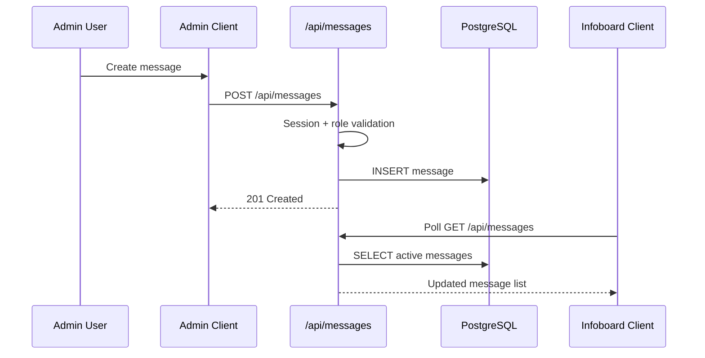

# TEC Info Board

Modern information board and administration platform for TEC, built with Next.js App Router, Better Auth, Drizzle ORM, and PostgreSQL.

> [!NOTE]
> This README is generated from the current repository state (analyzed recursively) on April 9, 2026.

## 📖 Project Overview

TEC Info Board is a dual-surface application:

- **Infoboard surface**: a kiosk-style, read-optimized display for weather, departures, canteen menu, traffic, news, contacts, calendar, intranet content, kitchen duty, and pinned messages.
- **Admin surface**: authenticated teacher/admin workspace for user management, invites, message CRUD, calendar/events/categories CRUD, tile visibility control, intranet editing, uploads, and dashboard analytics.

Primary goals:

- Deliver a reliable real-time school information display.
- Keep editorial workflows simple for staff.
- Centralize data in one secure, role-aware backend.

## ✨ Features

- Next.js 16 App Router architecture with route handlers in `src/app/api/**`.
- Better Auth integration (credentials auth + admin plugin + trusted origins).
- Role-based authorization (`teacher`, `admin`) on protected APIs.
- Security-hardened sign-in API with IP + email rate-limiting.
- Dynamic tile configuration persisted in DB (`setting` table).
- Message scheduling (`activeFrom`, `expiresAt`, `repeatDays`, `pinned`).
- Calendar events and categories with cascade-safe category deletion behavior.
- Invitation onboarding flow (`/api/admin/invite` + `/api/invite/[token]`).
- File uploads with MIME and magic-byte validation.
- External integrations:
	- MET weather API
	- Rejseplanen departures API
	- DR traffic API
	- DR RSS/news pages
	- Kanpla menu API
	- Kalendarium API

## 🧭 Architecture

```mermaid
flowchart TD
	A[Infoboard UI<br/>src/app/(infoboard)] --> C[Route Handlers<br/>src/app/api]
	B[Admin UI<br/>src/app/admin] --> C
	C --> D[(PostgreSQL)]
	C --> E[MET Weather API]
	C --> F[Rejseplanen API]
	C --> G[Kanpla API]
	C --> H[DR Trafik API]
	C --> I[DR RSS + article pages]
	C --> J[Kalendarium API]
	B --> K[Better Auth Session]
	C --> K
```



## 🗂️ Repository Structure

### Tree View (source-focused)

```text
tec-info/
├─ drizzle/
│  ├─ *.sql                         # Drizzle migrations
│  └─ meta/                         # Migration snapshots/journal
├─ public/
│  ├─ logo/                         # Brand/logo assets
│  └─ weather/                      # Weather icon assets + symbol mapping
├─ src/
│  ├─ app/
│  │  ├─ (infoboard)/               # Public display routes and section pages
│  │  ├─ admin/                     # Teacher/admin interface routes
│  │  ├─ api/                       # REST API route handlers
│  │  ├─ invite/                    # Invite acceptance UI
│  │  ├─ reset-password/            # Password reset UI
│  │  ├─ layout.tsx                 # Root app layout + providers
│  │  ├─ globals.css                # Global styles
│  │  └─ contacts.json              # Contact data source for /api/kontakter
│  ├─ components/
│  │  ├─ admin/                     # Admin-specific UI components
│  │  ├─ intranet/                  # Intranet editor/renderer components
│  │  ├─ panels/                    # Info panel components
│  │  └─ ui/                        # Shared UI primitives
│  ├─ db/
│  │  ├─ index.ts                   # Drizzle client initialization
│  │  ├─ schema.ts                  # Full DB schema definitions
│  │  └─ seed.ts                    # Seed script for initial users
│  ├─ hooks/                        # Client hooks for data + UX guards
│  ├─ lib/                          # Core business logic/auth/utilities
│  ├─ styles/                       # SCSS vars/animations/editor styles
│  ├─ types/                        # Shared API/front-end TS contracts
│  └─ proxy.ts                      # Next.js proxy (security headers + redirect)
├─ drizzle.config.ts                # Drizzle toolkit config
├─ next.config.ts                   # Next.js runtime config
├─ package.json                     # Scripts + dependencies
├─ tsconfig.json                    # TS compiler options
└─ eslint.config.mjs                # Lint config
```

### Main Module Relationships

- `src/app/(infoboard)` renders live panels that consume public APIs.
- `src/app/admin` enforces session + role checks for protected workflows.
- `src/app/api/**` contains all HTTP contracts and business rules.
- `src/lib/auth.ts` + `src/lib/session-role.ts` gate privileged access.
- `src/db/schema.ts` centralizes data model consumed by API handlers.
- `src/lib/tiles-config.ts` + `setting` table drive runtime tile visibility/order.

## 📦 Technologies

| Category | Stack |
| --- | --- |
| Language | TypeScript, SQL |
| Runtime | Node.js, Next.js 16.2.1, React 19.2.3 |
| UI | Tailwind CSS v4, Sass, Radix UI, shadcn/ui, Framer Motion, Recharts |
| Auth | better-auth + better-auth admin plugin |
| Data | PostgreSQL, Drizzle ORM, drizzle-kit |
| Email | Nodemailer |
| Tooling | ESLint 9, TypeScript 5, pnpm, tsx, cross-env |

<details>
<summary><strong>Dependency Snapshot</strong></summary>

### Runtime dependencies

- `next`, `react`, `react-dom`
- `better-auth`
- `drizzle-orm`, `pg`, `@neondatabase/serverless`
- `nodemailer`
- `framer-motion`, `recharts`
- `@tiptap/*`
- `lucide-react`, `radix-ui`, `@radix-ui/react-scroll-area`
- `react-markdown`, `remark-gfm`, `react-day-picker`, `react-phone-number-input`
- `clsx`, `tailwind-merge`, `date-fns`

### Dev dependencies

- `typescript`, `eslint`, `eslint-config-next`
- `drizzle-kit`, `tsx`, `dotenv`, `cross-env`
- `tailwindcss`, `@tailwindcss/postcss`, `postcss`, `sass`
- `@types/*` packages for Node, React, PG, Nodemailer

</details>

## ✅ Requirements

- Node.js 20+ recommended.
- pnpm 9+ recommended.
- PostgreSQL database reachable from `DATABASE_URL`.
- SMTP credentials (required for invite/reset password email workflows).
- Internet access for external data providers (weather/departures/news/traffic/menu/calendar).

## 🚀 Installation Guide

### 1. Install dependencies

```bash
pnpm install
```

### 2. Configure environment

Create `.env.local` (preferred for local development).

```env
BETTER_AUTH_SECRET=
BETTER_AUTH_URL=http://localhost:3000
NEXT_PUBLIC_BETTER_AUTH_URL=http://localhost:3000
DATABASE_URL=
COOKIE_DOMAIN=
SMTP_HOST=smtp.gmail.com
SMTP_PORT=465
SMTP_USER=
SMTP_PASS=
SMTP_SECURE=true
REJSEPLANEN_API_KEY=
REJSEPLANEN_STOP_ID_1=3849
REJSEPLANEN_STOP_ID_2=2859
```

### 3. Run database migrations

```bash
pnpm db:generate
pnpm db:push
```

### 4. Seed initial users

```bash
pnpm seed
```

> [!CAUTION]
> The seed script creates default demo credentials (`admin@tec.dk`, `instruktor@tec.dk` with `password123`). Rotate/change credentials immediately in non-local environments.

### 5. Start development server

```bash
pnpm dev
```

Open: `http://localhost:3000`

## 🔧 Configuration

### Environment Variables

| Variable | Required | Used In | Purpose |
| --- | --- | --- | --- |
| `BETTER_AUTH_SECRET` | Yes | `src/lib/auth.ts` | Better Auth signing secret |
| `BETTER_AUTH_URL` | Yes | `src/lib/auth.ts`, `src/app/api/sign-in/route.ts`, `src/lib/email.ts` | Auth base URL(s), CORS checks, invite URL base |
| `NEXT_PUBLIC_BETTER_AUTH_URL` | Yes (client auth) | `src/lib/auth-client.ts` | Client auth endpoint base URL |
| `DATABASE_URL` | Yes | `src/db/index.ts`, `drizzle.config.ts` | PostgreSQL connection string |
| `COOKIE_DOMAIN` | Optional | `src/lib/auth.ts` | Shared cookie domain override |
| `SMTP_HOST` | Yes (email features) | `src/lib/email.ts` | SMTP host |
| `SMTP_PORT` | Yes (email features) | `src/lib/email.ts` | SMTP port |
| `SMTP_USER` | Yes (email features) | `src/lib/email.ts` | SMTP username + From address |
| `SMTP_PASS` | Yes (email features) | `src/lib/email.ts` | SMTP password |
| `SMTP_SECURE` | Optional | `src/lib/email.ts` | TLS mode toggle |
| `REJSEPLANEN_API_KEY` | Yes for live departures | `src/app/api/departures/route.ts` | Rejseplanen access key |
| `REJSEPLANEN_STOP_ID_1` | Optional | `src/app/api/departures/route.ts` | Primary stop id (default 3849) |
| `REJSEPLANEN_STOP_ID_2` | Optional | `src/app/api/departures/route.ts` | Secondary stop id (default 2859) |

### Config Files

| File | Purpose |
| --- | --- |
| `next.config.ts` | External `pg` package handling + image remote patterns |
| `drizzle.config.ts` | Schema path/output/dialect/db credentials for migrations |
| `tsconfig.json` | Strict TS config + `@/*` path alias |
| `eslint.config.mjs` | Next.js core web vitals + TS linting |
| `postcss.config.mjs` | Tailwind v4 PostCSS plugin |
| `components.json` | shadcn/ui generator settings and aliases |
| `src/proxy.ts` | Security headers, `/login` redirect, `x-pathname` forwarding |

> [!WARNING]
> `src/proxy.ts` is the active request interceptor for Next.js 16. Do not add `src/middleware.ts` in parallel.

## 🛠️ Usage

### Common Commands

| Command | Description |
| --- | --- |
| `pnpm dev` | Start development server |
| `pnpm build` | Production build |
| `pnpm start` | Start production server |
| `pnpm lint` | Run ESLint |
| `pnpm db:generate` | Generate Drizzle migration files |
| `pnpm db:push` | Push schema to DB |
| `pnpm db:studio` | Open Drizzle Studio |
| `pnpm seed` | Seed initial users |

### Typical Workflows

1. **Infoboard operation**:
	 Load `/` and let panels auto-refresh from public APIs.
2. **Admin login and editing**:
	 Open `/admin`, authenticate, then manage messages/calendar/users/intranet/display settings.
3. **Invite onboarding**:
	 Admin sends invite; recipient completes `/invite/[token]` to activate account.

## 📄 REST API Documentation

### Auth Model

- **Public endpoints**: no session required.
- **Teacher/Admin endpoints**: valid session + role in `teacher` or `admin`.
- **Admin-only endpoints**: valid session + role `admin`.

### Endpoint Matrix

| Method | Endpoint | Auth | Description |
| --- | --- | --- | --- |
| GET | `/api/weather` | Public | Current weather + forecast |
| GET | `/api/departures` | Public | Public transport departures |
| GET | `/api/trafik` | Public | DR traffic items |
| GET | `/api/daily-dish` | Public | Daily dish summary |
| GET | `/api/canteen` | Public | Canteen item listing |
| GET | `/api/calendar` | Public | Generic calendar events payload |
| GET | `/api/calendar/[year]` | Public | Danish calendar by year |
| GET | `/api/dr-news` | Public | DR news feed + cached enrichment |
| GET | `/api/kontakter` | Public | Filtered instructor contacts |
| GET | `/api/intranet-faq` | Public | FAQ entries |
| GET | `/api/tiles-config` | Public | Tile visibility/order config |
| PUT | `/api/tiles-config` | Teacher/Admin | Update tile config |
| GET | `/api/messages` | Public or Teacher/Admin* | Public active messages; admin mode with `?admin=true` |
| POST | `/api/messages` | Teacher/Admin | Create message |
| PATCH | `/api/messages/[id]` | Teacher/Admin | Update own message (admin can update all) |
| DELETE | `/api/messages/[id]` | Teacher/Admin | Delete own message (admin can delete all) |
| GET | `/api/kokkenvagt` | Public or Teacher/Admin* | Public future entries; admin mode with `?admin=true` |
| POST | `/api/kokkenvagt` | Teacher/Admin | Create kitchen duty entry |
| PATCH | `/api/kokkenvagt/[id]` | Teacher/Admin | Update own entry (admin all) |
| DELETE | `/api/kokkenvagt/[id]` | Teacher/Admin | Delete own entry (admin all) |
| GET | `/api/calendar-events` | Teacher/Admin | List events |
| POST | `/api/calendar-events` | Teacher/Admin | Create event |
| PATCH | `/api/calendar-events/[id]` | Teacher/Admin | Update own event (admin all) |
| DELETE | `/api/calendar-events/[id]` | Teacher/Admin | Delete own event (admin all) |
| GET | `/api/calendar-categories` | Teacher/Admin | List categories |
| POST | `/api/calendar-categories` | Teacher/Admin | Create category |
| DELETE | `/api/calendar-categories/[id]` | Teacher/Admin | Delete category (with event category nulling) |
| POST | `/api/sign-in` | Public | Rate-limited credential sign-in |
| GET | `/api/invite/[token]` | Public | Read invitation metadata |
| POST | `/api/invite/[token]` | Public | Accept invitation |
| GET | `/api/admin/users` | Admin | List users |
| POST | `/api/admin/users` | Admin | Create user |
| PATCH | `/api/admin/users/[id]` | Admin | Update user |
| DELETE | `/api/admin/users/[id]` | Admin | Delete user with protections |
| POST | `/api/admin/invite` | Admin | Create invitation + send email |
| POST | `/api/admin/invite/resend` | Admin | Reissue invite token |
| POST | `/api/admin/upload` | Teacher/Admin | Upload documents/images |
| POST | `/api/admin/avatar` | Teacher/Admin | Upload avatar image |
| GET | `/api/admin/dashboard/messages-chart` | Teacher/Admin | Dashboard timeseries metrics |
| GET,POST | `/api/auth/[...all]` | Managed by better-auth | Auth transport routes |

### Detailed API Contracts

<details>
<summary><strong>Public Data Endpoints</strong></summary>

#### `GET /api/weather`

- **Purpose**: Current weather + 5-day forecast.
- **Auth**: Public.
- **Response** (`200`):

```json
{
	"updatedAt": "2026-04-09T06:40:00.000Z",
	"temperatureC": 7.2,
	"humidityPct": 71,
	"windMs": 3.5,
	"windKmh": 12.6,
	"symbolCode": "partlycloudy_day",
	"condition": "Delvist skyet",
	"forecastDays": [
		{
			"date": "2026-04-09",
			"weekday": "torsdag",
			"minC": 5,
			"maxC": 11,
			"condition": "Skyet",
			"symbolCode": "cloudy"
		}
	]
}
```

#### `GET /api/departures`

- **Purpose**: Multi-stop departure grouping.
- **Auth**: Public.
- **Response** (`200`):

```json
{
	"fetchedAt": "2026-04-09T06:45:10.000Z",
	"groups": [
		{
			"id": "stop-1",
			"title": "Fra station A",
			"sourceStopId": "3849",
			"departures": [
				{
					"line": "A",
					"destination": "København H",
					"time": "06:52",
					"minutesUntil": 7,
					"type": "train",
					"platform": "3",
					"delayMin": 0,
					"cancelled": false
				}
			]
		}
	]
}
```

#### `GET /api/trafik`

- **Purpose**: DR traffic incidents with recent updates.
- **Auth**: Public.
- **Response** (`200`):

```json
{
	"fetchedAt": "2026-04-09T06:45:10.000Z",
	"items": [
		{
			"_id": "abc123",
			"region": "hovedstaden",
			"type": "trafikuheld",
			"text": "Kø på vejstrækning...",
			"updates": []
		}
	]
}
```

#### `GET /api/daily-dish`

- **Purpose**: Daily meal summary from Kanpla.
- **Auth**: Public.
- **Response** (`200`) includes `found`, `servingToday`, `regular`, `vegetarian`, `weekMenu`.

#### `GET /api/canteen`

- **Purpose**: Canteen inventory-like list grouped by category.
- **Auth**: Public.
- **Response** (`200`):

```json
{
	"items": [
		{
			"name": "Kaffe",
			"price": "12 kr",
			"category": "Varme drikke"
		}
	]
}
```

#### `GET /api/calendar`

- **Purpose**: Display-friendly calendar event feed.
- **Auth**: Public.
- **Response**: `{ "configured": boolean, "events": CalendarEvent[] }`.

#### `GET /api/calendar/[year]`

- **Purpose**: Year-specific Danish calendar from external provider.
- **Path params**: `year: string`.
- **Response** includes `days`, `solhvervOgJævndøgn`, `flagdage`.

#### `GET /api/dr-news`

- **Purpose**: DR RSS + article enrichment with DB cache (`dr_news_article`).
- **Auth**: Public.
- **Response**: `items: DrNewsItem[]`.

#### `GET /api/kontakter`

- **Purpose**: Contact list from `src/app/contacts.json`, filtered to instructors.
- **Auth**: Public.

</details>

<details>
<summary><strong>Tile Config + FAQ Endpoints</strong></summary>

#### `GET /api/tiles-config`

- **Auth**: Public.
- **Returns**: `TileConfig[]`.

#### `PUT /api/tiles-config`

- **Auth**: Teacher/Admin.
- **Body**:

```json
[
	{ "id": "afgange", "visible": true, "label": "Afgange", "order": 0 }
]
```

- **Success**: `{ "success": true }`.

#### `GET /api/intranet-faq`

- **Auth**: Public.
- **Returns**: normalized FAQ array.

#### `PUT /api/intranet-faq`

- **Auth**: Teacher/Admin.
- **Body**: `IntranetFaqItem[]`.
- **Success**: `{ "success": true, "items": [...] }`.

</details>

<details>
<summary><strong>Messages Endpoints</strong></summary>

#### `GET /api/messages`

- **Auth**:
	- Public mode: no auth.
	- Admin mode (`?admin=true`): Teacher/Admin required.
- **Public output**: active, date-valid, repeat-day-valid messages (max 10).
- **Admin output**: full list + `canManage` flag.

#### `POST /api/messages`

- **Auth**: Teacher/Admin.
- **Body**:

```json
{
	"title": "Vigtig besked",
	"content": "Husk værkstedsmøde kl. 10",
	"priority": "high",
	"active": true,
	"pinned": true,
	"repeatDays": [1, 2, 3, 4, 5]
}
```

- **Success**: created message (`201`).

#### `PATCH /api/messages/[id]`

- **Auth**: Teacher/Admin.
- **Ownership rule**: non-admin can update own messages only.
- **Body**: partial of message payload.

#### `DELETE /api/messages/[id]`

- **Auth**: Teacher/Admin.
- **Ownership rule**: non-admin can delete own messages only.
- **Success**: `{ "success": true }`.

</details>

<details>
<summary><strong>Køkkenvagt Endpoints</strong></summary>

#### `GET /api/kokkenvagt`

- **Public mode**: returns current/future entries.
- **Admin mode (`?admin=true`)**: returns all entries; requires Teacher/Admin.

#### `POST /api/kokkenvagt`

- **Auth**: Teacher/Admin.
- **Body**:

```json
{
	"week": 15,
	"year": 2026,
	"person1": "Navn A",
	"person2": "Navn B",
	"note": "Morgenhold",
	"startTime": "08:00",
	"endTime": "10:00"
}
```

#### `PATCH /api/kokkenvagt/[id]`

- **Auth**: Teacher/Admin.
- **Rule**: non-admin can patch only own entries.

#### `DELETE /api/kokkenvagt/[id]`

- **Auth**: Teacher/Admin.
- **Rule**: non-admin can delete only own entries.

</details>

<details>
<summary><strong>Calendar Event + Category Endpoints</strong></summary>

#### `GET /api/calendar-events`

- **Auth**: Teacher/Admin.
- **Returns**: event list with author metadata.

#### `POST /api/calendar-events`

- **Auth**: Teacher/Admin.
- **Body**:

```json
{
	"title": "Åbent hus",
	"start": "2026-04-11T08:00:00.000Z",
	"end": "2026-04-11T12:00:00.000Z",
	"allDay": false,
	"location": "Bygning A",
	"description": "Velkomst for nye elever",
	"category": "Arrangement"
}
```

#### `PATCH /api/calendar-events/[id]`

- **Auth**: Teacher/Admin.
- **Rule**: non-admin can patch own events only.

#### `DELETE /api/calendar-events/[id]`

- **Auth**: Teacher/Admin.
- **Rule**: non-admin can delete own events only.

#### `GET /api/calendar-categories`

- **Auth**: Teacher/Admin.
- **Returns**: category list.

#### `POST /api/calendar-categories`

- **Auth**: Teacher/Admin.
- **Body**: `{ "name": "Arrangement" }`.

#### `DELETE /api/calendar-categories/[id]`

- **Auth**: Teacher/Admin.
- **Behavior**: sets matching `calendar_event.category` to `null` before delete.

</details>

<details>
<summary><strong>Auth + Invite Endpoints</strong></summary>

#### `POST /api/sign-in`

- **Auth**: Public.
- **Body**:

```json
{ "email": "admin@tec.dk", "password": "password123" }
```

- **Security controls**:
	- IP bucket: 5 failures / 15 min window -> 15 min block.
	- Email bucket: 5 failures / 24h window -> blocked until reset window.
	- Content-Type enforcement (`application/json`).
	- Origin checks vs same-origin and `BETTER_AUTH_URL`.

#### `GET /api/invite/[token]`

- **Auth**: Public.
- **Purpose**: Validate invite token and return `email`, `role`.

#### `POST /api/invite/[token]`

- **Auth**: Public.
- **Body**:

```json
{
	"name": "Lærer Navn",
	"password": "StrongPassword123",
	"phoneNumber": "+45 12 34 56 78",
	"image": "/uploads/avatar.png"
}
```

- **Behavior**: verifies invite validity, writes user/account, marks invite accepted.

#### `GET, POST /api/auth/[...all]`

- **Transport**: delegated to Better Auth handler.

</details>

<details>
<summary><strong>Admin Endpoints</strong></summary>

#### `GET /api/admin/users`

- **Auth**: Admin only.
- **Returns**: user list (`id`, `name`, `email`, `role`, `image`, `createdAt`).

#### `POST /api/admin/users`

- **Auth**: Admin only.
- **Body**:

```json
{
	"name": "Ny Bruger",
	"email": "user@tec.dk",
	"password": "StrongPassword123",
	"role": "teacher"
}
```

#### `PATCH /api/admin/users/[id]`

- **Auth**: Admin only.
- **Body**: `{ "name"?: string, "role"?: "teacher" | "admin" }`.

#### `DELETE /api/admin/users/[id]`

- **Auth**: Admin only.
- **Protection rules**:
	- cannot self-delete,
	- cannot delete last admin,
	- cannot demote final admin role holder.

#### `POST /api/admin/invite`

- **Auth**: Admin only.
- **Body**: `{ "email": string, "role": "teacher" | "admin" }`.
- **Side effect**: sends invite email via Nodemailer.

#### `POST /api/admin/invite/resend`

- **Auth**: Admin only.
- **Body**: `{ "email": string }`.

#### `POST /api/admin/upload`

- **Auth**: Teacher/Admin.
- **Input**: multipart form (`file`).
- **Validation**: MIME + magic bytes + max 10 MB.
- **Output**: `{ "url": string, "name": string }`.

#### `POST /api/admin/avatar`

- **Auth**: Teacher/Admin.
- **Input**: multipart form (`avatar`).
- **Validation**: image MIME + signature + max 4 MB.
- **Output**: `{ "url": string }`.

#### `GET /api/admin/dashboard/messages-chart`

- **Auth**: Teacher/Admin.
- **Query**: `days` (7..90, default 30).
- **Output**: day-by-day `{ current, previous }` timeseries.

</details>

## 🧩 Module & Function Documentation

### Core Runtime Exports

| Symbol | Location | Parameters | Returns | Description |
| --- | --- | --- | --- | --- |
| `auth` | `src/lib/auth.ts` | Better Auth config object | Better Auth instance | Main auth runtime (sessions, cookies, plugins, trusted origins). |
| `authClient` | `src/lib/auth-client.ts` | n/a | Auth client | Browser auth client with admin plugin. |
| `useSession` | `src/lib/auth-client.ts` | n/a | hook result | Read current auth session in client components. |
| `signOut` | `src/lib/auth-client.ts` | n/a | Promise | Sign out current user. |
| `db` | `src/db/index.ts` | n/a | Drizzle db client | PostgreSQL data access instance. |
| `proxy(request)` | `src/proxy.ts` | `NextRequest` | `NextResponse` | Redirects `/login`, forwards `x-pathname`, applies security headers. |
| `getUserRole(session)` | `src/lib/session-role.ts` | `unknown` | `string | undefined` | Safe role extraction helper. |

### Utility Functions (`src/lib/utils.ts`)

| Function | Parameters | Returns | Purpose |
| --- | --- | --- | --- |
| `cn` | `(...inputs: ClassValue[])` | `string` | Classname merge helper (`clsx` + `tailwind-merge`). |
| `decodeHtmlEntities` | `(html: string)` | `string` | Decodes named and numeric HTML entities. |
| `lineBadgeStyle` | `(line: string)` | `{ bg: string; text: string }` | Maps transit line codes to badge colors. |
| `getWeatherIcon` | `(symbolCode?: string, timestamp?: string|number)` | `string` | Resolves weather icon path with day/night logic. |

### Intranet Content Functions (`src/lib/intranet-content.ts`)

| Function | Parameters | Returns | Purpose |
| --- | --- | --- | --- |
| `isLikelyHtmlContent` | `(content: string)` | `boolean` | Detects if content already looks like HTML. |
| `normalizeEditorContent` | `(content: string)` | `string` | Converts markdown-like input to normalized HTML. |
| `stripIntranetContent` | `(content: string)` | `string` | Removes tags/extra whitespace for plain text previewing. |

### FAQ Functions (`src/lib/intranet-faq.ts`)

| Function | Parameters | Returns | Purpose |
| --- | --- | --- | --- |
| `normalizeIntranetFaqItems` | `(input: unknown)` | `IntranetFaqItem[]` | Validates/sanitizes FAQ payload with fallback defaults. |

### Kanpla Functions (`src/lib/kanpla-api.ts`)

| Function | Parameters | Returns | Purpose |
| --- | --- | --- | --- |
| `formatPriceDkk` | `(unitPrice?: number, unitSystem?: string)` | `string` | Formats DKK price labels. |
| `toDateKeyInCopenhagen` | `(dateSeconds: number)` | `string` | Converts unix timestamp to local date key `YYYY-MM-DD`. |
| `toDateLabelDa` | `(dateSeconds: number)` | `string` | Danish date label formatter. |
| `normalize` | `(text: string)` | `string` | Whitespace-normalized text helper. |
| `extractMenuItems` | `(payload, options?)` | `Map<string, DayMenuItems>` | Extracts menu candidates by day and menu type. |
| `fetchKanplaData` | `()` | `Promise<KanplaFrontendPayload>` | Fetches raw Kanpla frontend payload. |

### Email Functions (`src/lib/email.ts`)

| Function | Parameters | Returns | Purpose |
| --- | --- | --- | --- |
| `sendInviteEmail` | `(to: string, token: string, role: string)` | `Promise<string>` | Sends invitation email and returns invite link. |
| `sendResetPasswordEmail` | `(to: string, url: string)` | `Promise<void>` | Sends reset-password email. |

### Hooks (`src/hooks/*`)

| Hook | Parameters | Returns | Purpose |
| --- | --- | --- | --- |
| `useWeatherData` | none | `WeatherApiResponse | null` | Polls `/api/weather` and updates on visibility/online events. |
| `useDailyDishData` | none | `DailyDishApiResponse | null` | Polls `/api/daily-dish`. |
| `useDepartureGroupsData` | none | `DepartureGroup[]` | Polls `/api/departures` with change-signature checks. |
| `useIsMobile` | none | `boolean` | `<768px` media query hook. |
| `useUnsavedChangesGuard` | options object | void | Navigation interception + confirm dialog for dirty forms. |

### Component Exports (UI/Feature Modules)

| Component | Location | Props (inferred) | Returns | Purpose |
| --- | --- | --- | --- | --- |
| `StatusBar` | `src/components/StatusBar.tsx` | none | `JSX.Element` | Top bar with time/date/weather |
| `TopCarousel` | `src/components/TopCarousel.tsx` | none | `JSX.Element` | Rotating panel carousel for front page |
| `NavTiles` | `src/components/NavTiles.tsx` | none | `JSX.Element` | Tile navigation grid from tile config |
| `LatestMessageBlock` | `src/components/LatestMessageBlock.tsx` | none | `JSX.Element` | Sticky-note style latest important message |
| `SectionPageShell` | `src/components/SectionPageShell.tsx` | title/subtitle/children/etc. | `JSX.Element` | Shared section wrapper + tile visibility guard |
| `InfoBoardIdleGuard` | `src/components/InfoBoardIdleGuard.tsx` | idle/countdown options | `JSX.Element` | Inactivity timeout and redirect helper |
| `YellowStickyNote` | `src/components/YellowStickyNote.tsx` | note props | `JSX.Element` | Reusable sticky-note visual component |
| `AppSidebar` | `src/components/app-sidebar.tsx` | user + sidebar props | `JSX.Element` | Admin navigation sidebar |
| `NavMain` | `src/components/nav-main.tsx` | section config | `JSX.Element` | Sidebar section renderer |
| `NavUser` | `src/components/nav-user.tsx` | user props | `JSX.Element` | User profile nav block |
| `ChartBarInteractive` | `src/components/chart-bar-interactive.tsx` | `{ days?: number }` | `JSX.Element` | Interactive dashboard chart |
| `ConfirmDialogProvider` | `src/components/confirm-dialog-provider.tsx` | children | `JSX.Element` | Promise-based confirmation dialog context |
| `useConfirmDialog` | `src/components/confirm-dialog-provider.tsx` | none | function | Opens typed confirmation dialog |
| `AdminThemeProvider` | `src/components/admin/AdminThemeProvider.tsx` | theme props | `JSX.Element` | Admin theme state and persistence |
| `useAdminTheme` | `src/components/admin/AdminThemeProvider.tsx` | none | context state | Access admin theme controller |
| `AdminCreateButton` | `src/components/admin/AdminCreateButton.tsx` | action props | `JSX.Element` | Reusable action/create button |
| `IntranetMarkdownEditor` | `src/components/intranet/IntranetMarkdownEditor.tsx` | editor props | `JSX.Element` | Rich intranet markdown/tiptap editor |
| `IntranetFaqMarkdown` | `src/components/intranet/IntranetFaqMarkdown.tsx` | faq markdown props | `JSX.Element` | FAQ markdown rendering |
| `WeatherPanel` | `src/components/panels/WeatherPanel.tsx` | none | `JSX.Element` | Weather section panel |
| `TrafikPanel` | `src/components/panels/TrafikPanel.tsx` | none | `JSX.Element` | Traffic panel |
| `NewsPanel` | `src/components/panels/NewsPanel.tsx` | none | `JSX.Element` | DR news panel |
| `MessagesBoard` | `src/components/panels/MessagesBoard.tsx` | none | `JSX.Element` | Message board panel |
| `KokkenvagtPanel` | `src/components/panels/KokkenvagtPanel.tsx` | none | `JSX.Element` | Kitchen duty panel |
| `IntranetOnePage` | `src/components/panels/IntranetOnePage.tsx` | none | `JSX.Element` | Intranet one-page panel |
| `DeparturesPanel` | `src/components/panels/DeparturesPanel.tsx` | none | `JSX.Element` | Departures panel |
| `ContactsPanel` | `src/components/panels/ContactsPanel.tsx` | none | `JSX.Element` | Contacts panel |
| `CanteenGrid` / `CanteenDetail` | `src/components/panels/CanteenPanel.tsx` | grid none / `{ slug }` | `JSX.Element` | Canteen list/detail views |
| `CalendarPanel` | `src/components/panels/CalendarPanel.tsx` | none | `JSX.Element` | Calendar panel |
| `PhoneNumberInput` | `src/components/ui/phone-input.tsx` | controlled input props | `JSX.Element` | Phone number input wrapper |

### Data Model Exports (`src/db/schema.ts`)

| Export | Type | Purpose |
| --- | --- | --- |
| `user`, `session`, `account`, `verification` | tables | Authentication and identity |
| `message`, `calendarEvent`, `calendarCategory` | tables | Communication/calendar domains |
| `kokkenvagtEntry` | table | Kitchen duty scheduling |
| `intranetPage`, `setting`, `wageData` | tables | CMS/config/wage content |
| `invitation`, `authRateLimit` | tables | Invite flow + sign-in protection |
| `drNewsArticle` | table | News cache/enrichment persistence |
| relation exports | relation builders | Typed relational linking |

### Route-Local Helper Functions (Selected)

The API layer also defines several non-exported helper functions for parsing, validation, and transformations.

| Helper | Location | Purpose |
| --- | --- | --- |
| `toDanishCondition`, `groupByDay`, `buildForecast` | `src/app/api/weather/route.ts` | Weather transformation and forecast synthesis |
| `fetchStopDepartures`, `delayMinutes`, `isCancelled`, `etaSortValue` | `src/app/api/departures/route.ts` | Departure normalization/sorting/cancellation logic |
| `normalizeEmail`, `recordIpFailure`, `recordEmailFailure` | `src/app/api/sign-in/route.ts` | Sign-in hardening and rate-limit state transitions |
| `requireAdmin` / `ensureAdmin` helpers | several `src/app/api/admin/**` and category routes | Shared role gate utilities |
| `looksLikeImage`, `looksLikePdf`, `matchesImageSignature` | upload/avatar routes | Binary signature validation |
| DR parsing helpers (`extractTag`, `stripTags`, `parseRssItems`) | `src/app/api/dr-news/route.ts` | RSS/article parsing pipeline |

### Function Usage Examples

```ts
import { getUserRole } from "@/lib/session-role"
import { auth } from "@/lib/auth"
import { headers } from "next/headers"

export async function requireTeacherOrAdmin() {
	const session = await auth.api.getSession({ headers: await headers() })
	const role = getUserRole(session)
	if (!session || !["teacher", "admin"].includes(role ?? "")) return null
	return session
}
```

```ts
import { extractMenuItems, fetchKanplaData } from "@/lib/kanpla-api"

export async function getTodayMenu() {
	const payload = await fetchKanplaData()
	const dateKey = new Date().toISOString().slice(0, 10)
	const map = extractMenuItems(payload, { dateKeys: [dateKey] })
	return map.get(dateKey)
}
```

## 🔐 Security Notes

- Proxy applies strict security headers and strips `Server` header.
- Session cookies are secure/HTTP-only with strict same-site settings.
- Sign-in endpoint defends against brute-force by IP and email buckets.
- Upload endpoints enforce content signature validation, not just MIME claims.
- Admin routes and privileged APIs consistently gate by role.

## 🔄 Data and Workflow Summary

| Workflow | Source | Processing | Storage/Output |
| --- | --- | --- | --- |
| Weather | MET API | symbol + forecast transforms | `/api/weather` JSON |
| Departures | Rejseplanen | parse/cancel/delay/group logic | `/api/departures` JSON |
| News | DR RSS + article HTML | parse + enrich + cache | `dr_news_article` + `/api/dr-news` |
| Daily dish/canteen | Kanpla API | menu extraction/type classification | `/api/daily-dish`, `/api/canteen` |
| Messages | Admin CRUD | scheduling filters + ownership checks | `message` table + infoboard display |
| Calendar | Admin CRUD + external yearly feed | category and event handling | `calendar_event` / `/api/calendar*` |
| Invitations | Admin invite + recipient accept | token lifecycle + account creation | `invitation`, `user`, `account` |

## 🧾 Repository Activity Snapshot

Collected from local git metadata:

- **Commits**: 52
- **Contributors**: 3 (`Alexander Holm`, `copilot-swe-agent[bot]`, `Alexander Holm Mortensen`)
- **Local branches**: 1 (`main`)
- **Remote branches**: 5 (including `origin/main`, `origin/development`, and Copilot branches)
- **Tags**: 0
- **Recent push status**: last recorded `git push` succeeded.

> [!NOTE]
> Releases and issue state are not fully inferable from a local checkout alone unless provider APIs are queried with credentials.

## 🤝 Contributing

### Development Standards

1. Use TypeScript and existing `@/*` aliases.
2. Keep API contracts explicit and role checks centralized.
3. Validate all request input on route handlers.
4. Keep UI changes aligned with current design system/components.

### Suggested PR Flow

1. Create branch from `main`.
2. Implement feature/fix with focused commits.
3. Run checks:

```bash
pnpm lint
pnpm build
```

4. If schema changed, include generated Drizzle migration files.
5. Open PR with:
	 - problem statement,
	 - technical approach,
	 - API/schema impact,
	 - screenshots (if UI).

### Migration Rules

- Update `src/db/schema.ts` first.
- Run `pnpm db:generate` and commit generated SQL.
- Validate with `pnpm db:push` in a safe environment.

## 🧪 Testing and Quality

Current repository state does not include a dedicated automated test suite. Quality gates currently rely on:

- TypeScript compile-time checks,
- ESLint,
- Build validation,
- runtime checks in API handlers.

Recommended next step: add integration tests for critical APIs (`sign-in`, `messages`, `invite`, `admin/users`) and smoke tests for infoboard fetch flows.

## 📚 Quick Reference

- Main app layout: `src/app/layout.tsx`
- Infoboard home: `src/app/(infoboard)/page.tsx`
- Admin layout guard: `src/app/admin/layout.tsx`
- Auth runtime: `src/lib/auth.ts`
- DB schema: `src/db/schema.ts`
- API routes: `src/app/api/**/route.ts`
- Proxy/security headers: `src/proxy.ts`

